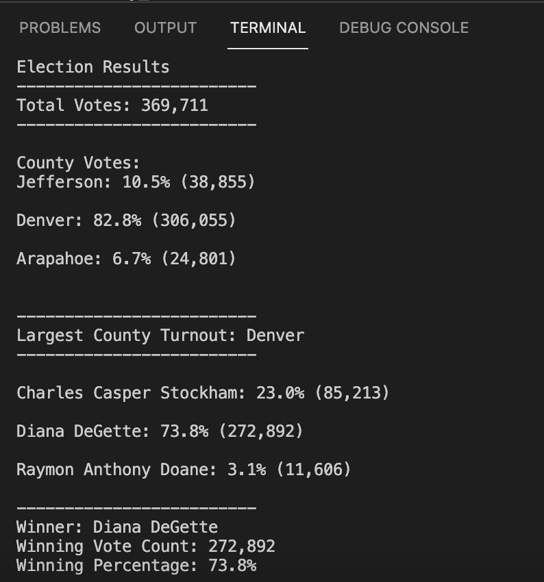

# ElectionAnalysis
1. Overview of Election Audit: 
  Initial audit request was on the following data points:
      - Total number of votes cast 
      - A complete list of candidates who received votes
      - Total number of votes each candidate received
      - Percentage of votes each candidate won
      - The winner of the election based on popular vote
      
  After providing the list above, it was necessary to build more on the initial work and deep dive into further 
  
      - The voter turnout for each county
      - The percentage of votes from each county out of the total count
      - The county with the highest turnout
      
  Looking at the election data more in details, specifically at county level provides more transparency to election commission.

2. Election-Audit Results: 

- How many votes were cast in this congressional election?
    Total votes = 369,711

- Provide a breakdown of the number of votes and the percentage of total votes for each county in the precinct.
    County Votes:
    Jefferson: 10.5% (38,855)
    Denver: 82.8% (306,055)
    Arapahoe: 6.7% (24,801)

- Which county had the largest number of votes?
    Denver

- Provide a breakdown of the number of votes and the percentage of the total votes each candidate received.
    Charles Casper Stockham: 23.0% (85,213)
    Diana DeGette: 73.8% (272,892)
    Raymon Anthony Doane: 3.1% (11,606)

- Which candidate won the election, what was their vote count, and what was their percentage of the total votes?
    Winner: Diana DeGette
    Winning Vote Count: 272,892
    Winning Percentage: 73.8%

3. Election-Audit Summary: In a summary statement, provide a business proposal to the election commission on how this script can be used—with some modifications—for any election. Give at least two examples of how this script can be modified to be used for other elections.
